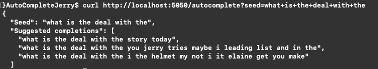

# Goal
Design and implement  an auto-complete server using scripts from all the episodes of Seinfeld. The server will try to predict how Jerry Seinfeld would finish a given incomplete sentence.

#### Dataset obtained from https://www.kaggle.com/thec03u5/seinfeld-chronicles

## Instructions

### Git clone the code
```
git clone https://github.com/ArbinTimilsina/AutoCompleteJerry.git
cd AutoCompleteJerry
```

### To train the model, do
```
python train_model.py --help

# Example
python train_model.py -e 1
```

### To use the model, do
```
python run_server.py
```
and then curl the following (or such) in a new terminal (or paste into a web browser)
```
http://localhost:5050/autocomplete?seed=What+is+the+deal
```

You will get output similar to



Replace the string after ```?seed=``` to change the seed and see suggested completions!


## Additional information

### To create a conda environment (Python 3)
```
conda create --name envAutoCompleteJerry python=3.5
conda activate envAutoCompleteJerry
pip install --upgrade pip
pip install -r requirements/cpu_requirements.txt
```

### Download the GloVe word embeddings
Head to https://nlp.stanford.edu/projects/glove/ and download the pre-computed embeddings from 2014 English Wikipedia. Un-zip it.

wget -O glove.6B.zip http://nlp.stanford.edu/data/glove.6B.zip
unzip glove.6B.zip -d glove
mv glove/* glove.6B

### To switch Keras backend to TensorFlow
```
KERAS_BACKEND=tensorflow python -c "from keras import backend"
```

### To open jupyter notebook

```
# Create an IPython kernel for the environment
python -m ipykernel install --user --name envAutoCompleteJerry --display-name "envAutoCompleteJerry"
```

```
# Open the notebook
jupyter notebook miscellaneous/model_creation_playground.ipynb

# Make sure to change the kernel to envAutoComplete using the drop-down menu (Kernel > Change kernel > envAutoCompleteJerry)
```
